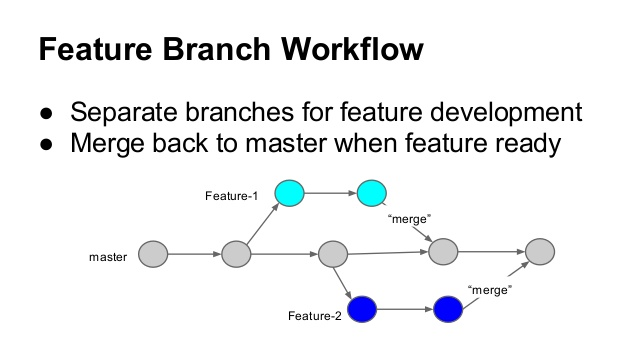

# Desenvolvimento distribuído com Git e onde aplicá-lo

Você já ouviu falar sobre desenvolvimento distribuído?

Bem, poucos desenvolvedores conhecem essa estratégia, outros já utilizam mas não tem ideia do fluxo no qual estão inseridos...

Vamos conhecê-las?

### Fluxo de trabalho centralizado

Este fluxo promove a colaboração de todo o time de desenvolvimento de uma determinada linguagem em um único repositório centralizado.

---

### Onde aplicá-lo? :hammer:

Em times pequenos, combinado há um fluxo de organização orientado a funcionalidades, permite uma rápida integração de código. 

---

### Fluxo de Trabalho do Gerente de Integração

Neste caso, cada desenvolvedor realiza um fork do projeto à ser contribuído, evoluí o código nessa cópia e abre um Pull Request para o mantenedor do repositório oficial. 
Para a posterior integração dessas alterações, o mantenedor adiciona essa cópia como um novo repositório remoto, fazendo o merge das alterações localmente.  Feito isso, o mantenedor da push das alterações para o repositório oficial.

---

### Onde aplicá-lo? :hammer:

Em times mais maduros, desenvolvendo softwares distribuidos e aumentando a qualidade de código através de Pull Requests e Code Review.

---

### Fluxo de Trabalho de Ditador e Tenentes

Neste fluxo, temos 3 papéis fundamentais: Os desenvolvedores, os tenentes e os ditadores. 
Os desenvolvedores trabalham a partir de um fork do repositório oficial que está sob o dominio do ditador, a partir da branch master. 
Os tenentes realizam o merge dos códigos dos desenvolvedores em uma branch de integração, onde posteriormente, o ditador fará o merge dessa branch na sua branch master. 
Feito isso, o ditador da push das suas alterações para o repositório oficial, onde os desenvolvedores farão o rebase com as novas alterações.

---

### Onde aplicá-lo? :hammer:

Em estruturas com multiplos times que refletem as funcionalidades de um respectivo software, delegando a integração de código aos tenentes e aos ditadores. 

> Exemplo:

---

Todos os fluxos estão voltados à complexidade de desenvolvimento de um software, podendo ser escalados, proporcionando qualidade e agilidade na entrega de novas funcionalidades.

A documentação do Git é uma ótima referência para o aprofundamento do conhecimento sobre os fluxos e muita rica em detalhes. 
[Distributed Git - Distributed Workflows](https://git-scm.com/book/en/v2/Distributed-Git-Distributed-Workflows)

Ficou alguma dúvida ou tem alguma sugestão? 
Aproveite os campos abaixo! 

Até a próxima.
