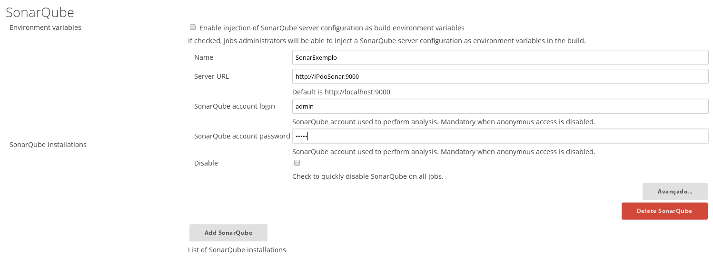
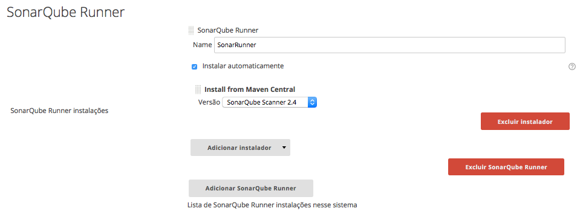
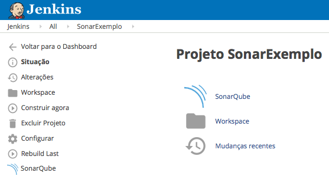
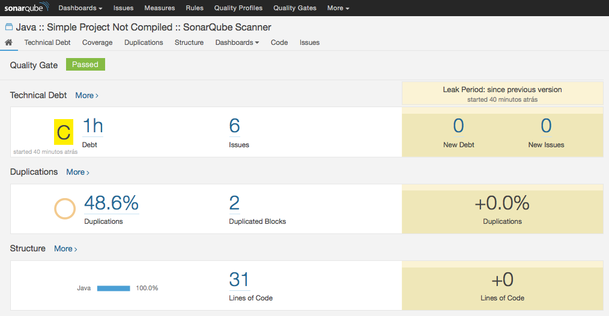

# Implementando a Análise Estática na Integração Contínua

Durante o desenvolvimento de um software, é comum encontrarmos bugs, más-práticas, além de problemas relacionados a estilo.<br />
A análise estática visa evidenciar esses problemas, sendo parte fundamental no processo de melhoria da qualidade do código-fonte.<br />
Com essa prática adotada em tempo de desenvolvimento, será muito menos doloroso a entrega em produção, podendo diminuir drasticamente os possíveis prejuizos gerados por esses problemas.<br />
Da mesma forma, o uso de boas práticas de orientação a objetos permite que o código seja flexível e suporte mudanças de forma mais tranquila, segura e natural.<br />
Partindo desse contexto, a etapa da qualidade se torna extremamente relevante no processo da Integração Contínua, pois é através desta que poderemos entregar um software íntegro e confiável aos usuários.<br />

Agora chega de teoria, vamos à pratica !<br />

> **Iremos provisionar um ambiente com as seguintes ferramentas:**



<br />
<br />
<br />
<br />
<br />
<br />
<br />

> **Como exemplo, vamos utilizar um projeto sample do Sonar com Java, partindo da integração do Jenkins até a disponibilização dos relatórios no Sonar.**

> [SonarExamples](https://github.com/SonarSource/sonar-examples)<br />

Falando sobre o Sonar, o sistema avalia mais de 20 linguagens, baseando-se em métricas pré-configuradas ou personalizadas (criadas) para o seu projeto.
Com essas métricas, a Integração Contínua pode ou não promover um artefato em um ambiente de desenvolvimento, testes ou produção.

Vamos partir da idéia de que você já está com o Docker instalado... Primeiro, vamos executar o script abaixo para provisionar o nosso ambiente local:

```bash
#!/usr/bin/env bash

PATH="$PATH"

CONT_JENKINS_NAME="jenkins"
CONT_SONAR_NAME="sonarqube"
CONTAINERS=( "$CONT_JENKINS_NAME" "$CONT_SONAR_NAME" )

function clearcontainers(){
  for c in "${CONTAINERS[@]}"; do
    ISRUNNING=$(docker ps | grep -o "$c")
    if [ -n "$ISRUNNING" ]; then
      docker kill $c
      docker rm $c
    else
      echo "Container $c parado"
    fi
  done
}

function pullcontainers(){
  for c in "${CONTAINERS[@]}"; do
    docker pull $c
  done
}

function runcontainers(){
  for c in "${CONTAINERS[@]}"; do
    if [ $c == $CONT_JENKINS_NAME ]; then
      docker run -d --name $CONT_JENKINS_NAME -p 8080:8080 -p 50000:50000 $CONT_JENKINS_NAME
    elif [ $c == $CONT_SONAR_NAME ]; then
      docker run -d --name $CONT_SONAR_NAME -p 9000:9000 -p 9092:9092 $CONT_SONAR_NAME
    fi
  done
}

function statuscontainers(){
  for c in "${CONTAINERS[@]}"; do
    STATUS=$(docker inspect --format="{{ .State.Running }}" $c)
    NAMES=$(docker inspect --format="{{ .Name }}" $c | cut -d'/' -f2)
    if [ $STATUS == "true" ]; then
      echo "Container $NAMES rodando"
    else
      echo "Container $NAMES parado"
      STATUS=$(docker inspect --format="{{ .State.Error }}" $c)
      echo "Erro:" $STATUS
    fi
  done
}

if `which docker > /dev/null`; then
  clearcontainers
  pullcontainers
  runcontainers
  statuscontainers
else
  echo "Docker não instalado"
fi
```

**Nesse post, nós vamos subir o Sonar em uma base interna não escalável, que pode não suportar os futuros upgrades do sistema, além de não ser possível realizar a migração dos dados para outra base de dados.<br />
Uma boa prática é subi-lo já apontando para um SGBD voltado para produção, como o MySQL ou o Postgres, por exemplo.**<br />

Vamos iniciar as configurações no Jenkins acessando a seguinte URL:
> [http://localhost:8080](http://localhost:8080)

Agora, vamos instalar os plugins necessários navegando até:
> - Gerenciar Jenkins
>  - Gerenciador de Plugins
>  - Clique na aba **Disponíveis**
>  - Instale os seguintes plugins: **SonarQube Plugin** e **Git plugin**

Após as instalações, é necessário configurarmos os plugins do Sonar em:

> - Gerenciar Jenkins
>  - SonarQube Runner
>  - SonarQube

**Preencher os dados conforme as figuras abaixo:**


<br />
<br />

<br />
<br />

Com os plugins instalados e configurados, podemos criar o nosso job de exemplo.<br />
Vamos nomeá-lo de **"SonarExemplo"**.<br />
Em **Gerenciamento de código fonte**, insira o seguinte repositório:

> https://github.com/SonarSource/sonar-examples.git

A branch **master** deve ser mantida.<br />
No step de **Build**, selecione **Invoke Standalone SonarQube Analysis**.<br />
Em **Analysis properties**, preencher com os seguintes dados:

```Java
# Required metadata
sonar.projectKey=org.sonarqube:java-simple-sq-scanner
sonar.projectName=Java :: Simple Project Not Compiled :: SonarQube Scanner
sonar.projectVersion=1.0

# Comma-separated paths to directories with sources (required)
sonar.sources=$WORKSPACE/projects/languages/java/sonar-runner/java-sonar-runner-simple/src

# Language
sonar.language=java

# Encoding of the source files
sonar.sourceEncoding=UTF-8
```

Com esses passos realizados, poderemos executar o nosso build e visualizar os resultados no Sonar.<br />
O Jenkins disponibiliza a URL de acesso aos relatórios no próprio job, conforme figura abaixo:


<br />
<br />
<br />
<br />
<br />
<br />
<br />
<br />
<br />
<br />
<br />

Vamos visualizar o sonar ?


<br />
<br />

Em um próximo post, vamos abordar as métricas do sistema e adequar à realidade do seu projeto !
Até a próxima.
